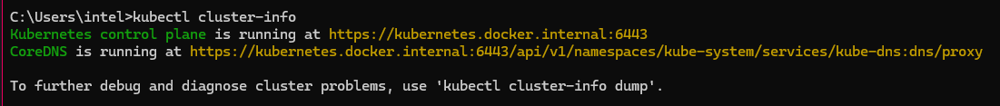

# Project 10: Use Kubernetes to Create a 2-Tier Deployment

- [Project 10: Use Kubernetes to Create a 2-Tier Deployment](#project-10-use-kubernetes-to-create-a-2-tier-deployment)
  - [Installation and Setup of Kubernetes](#installation-and-setup-of-kubernetes)
  - [Nginx deployment with NodePort service](#nginx-deployment-with-nodeport-service)
    - [Task: Get a NodePort service running](#task-get-a-nodeport-service-running)
    - [Task: Delete a Pod and Observe Behavior](#task-delete-a-pod-and-observe-behavior)
    - [Task: Scale Replicas Without Downtime](#task-scale-replicas-without-downtime)
    - [Task: Cleanup - Delete Deployments and Services](#task-cleanup---delete-deployments-and-services)
    - [Task: Increase Replicas with No Downtime](#task-increase-replicas-with-no-downtime)
    - [Task: Delete K8s Deployments and Services Using Manifests](#task-delete-k8s-deployments-and-services-using-manifests)
    - [Task: Delete K8s Deployments and Services Using kubectl](#task-delete-k8s-deployments-and-services-using-kubectl)
    - [Note to Self on Deletion](#note-to-self-on-deletion)
  - [Task: K8s deployment of NodeJS Sparta test app](#task-k8s-deployment-of-nodejs-sparta-test-app)
    - [Creating a Deployment for Sparta App](#creating-a-deployment-for-sparta-app)
    - [Creating a YAML file for the Sparta App](#creating-a-yaml-file-for-the-sparta-app)
    - [Creating a Deployment for Sparta App with a Service](#creating-a-deployment-for-sparta-app-with-a-service)
    - [Task: Create 2-tier deployment with PV for database](#task-create-2-tier-deployment-with-pv-for-database)
    - [Task: Setup minikube on a cloud instance running Ubuntu 22.04 LTS](#task-setup-minikube-on-a-cloud-instance-running-ubuntu-2204-lts)
    - [Task: Deploy Three Apps on Minikube](#task-deploy-three-apps-on-minikube)
      - [First App Deployment (Nginx Dream Team)](#first-app-deployment-nginx-dream-team)
      - [Second App Deployment](#second-app-deployment)
    - [Notes on Minikube Tunnel](#notes-on-minikube-tunnel)


## Installation and Setup of Kubernetes

1. On Docker Desktop, I enabled Kubernetes by going to Settings → Kubernetes → Enable Kubernetes. Click Apply & Restart.
2. Once this was done, I validated the installation by running `kubectl get nodes` and `kubectl get pods`. The latter command should return a list of pods, but it didn't because I hadn't deployed anything yet.
   
3. I ran `kubectl cluster-info` to check the cluster status. It returned the cluster name and the API server URL.
    
    For now, it displays an error message, because I have not set anything up yet.
    ```
     {
        "kind": "Status",
        "apiVersion": "v1",
        "metadata": {},
        "status": "Failure",
        "message": "forbidden: User \"system:anonymous\" cannot get path \"/\"",
        "reason": "Forbidden",
        "details": {},
        "code": 403
     }
    ```
    

4. I ran `kubectl get service` to check the services. It returned this:
   
    ```
        C:\Users\intel>kubectl get service
        NAME         TYPE        CLUSTER-IP   EXTERNAL-IP   PORT(S)   AGE
        kubernetes   ClusterIP   10.96.0.1    <none>        443/TCP   17m
    ```

## Nginx deployment with NodePort service

1. I created a deployment using the Nginx image. I used the command `kubectl create deployment nginx --image=nginx`. This created a deployment named "nginx" with the Nginx image.
2. To access the Nginx deployment, I followed these steps:
- I then set up a NodePort service using the command `kubectl expose deployment nginx --type=NodePort --port=80`. This created a NodePort service for the Nginx deployment.
- To port forward the service, I ran `kubectl port-forward service/nginx 1337:80`. This forwarded port 8080 on my local machine to port 80 on the Nginx service.
- To access the Nginx deployment, I opened a web browser and navigated to `localhost:1337`. This opened the Nginx web page.
  

### Task: Get a NodePort service running

1. I created a YAML file named `nginx-service.yml` in the `/k8s-yaml-definitions/local-nginx-deploy` directory of my repository with the following content:

```yaml
apiVersion: v1
kind: Service
metadata:
  name: nginx-svc
spec:
  type: NodePort
  ports:
    - port: 80
      targetPort: 80
      nodePort: 30001
  selector:
    app: nginx
```

2. I applied the service configuration using:
```
kubectl apply -f nginx-service.yml
```

3. I verified the service was created and running with:
```
kubectl get services
```

The Nginx service was accessible through `localhost:30001`

To delete it I can use:
```
kubectl delete service nginx-svc
```

Returned a `service "nginx-svc" deleted` message.

My output:
```
PS C:\Users\intel\OneDrive\Documents\GitHub\kubernetes-project\Kubernetes\nginx_only> kubectl get services        
NAME         TYPE        CLUSTER-IP       EXTERNAL-IP   PORT(S)        AGE
kubernetes   ClusterIP   10.96.0.1        <none>        443/TCP        4d2h
nginx-svc    NodePort    10.104.118.108   <none>        80:30001/TCP   71s
```

I created a YAML file named `nginx-pod.yml` in the directory with the following content:

```yaml
apiVersion: v1
kind: Pod
metadata:
  name: nginx-pod
  labels:
    app: nginx
spec:
  containers:
  - name: nginx
    image: nginx:latest
    ports:
    - containerPort: 80
```

1. I applied the pod configuration using:
```
kubectl apply -f nginx-pod.yml
```

1. I verified the pod was created and running with:
```
kubectl get pods
```

My output:
```
NAME        READY   STATUS    RESTARTS   AGE
nginx-pod   1/1     Running   0          5s
```


### Task: Delete a Pod and Observe Behavior

1. First, I listed all pods using:
   ```
   kubectl get pods
   ```

2. I then deleted one of the pods using its name:
   ```
   kubectl delete pod nginx-pod
   ```

    This returned:
    ```
    PS C:\Users\intel\OneDrive\Documents\GitHub\kubernetes-project\Kubernetes\nginx_only> kubectl delete pod nginx-pod
    pod "nginx-pod" deleted
    ```

3. Immediately after deletion, I observed that Kubernetes automatically created a new pod to maintain the desired state. This demonstrated Kubernetes' self-healing capability.
   ```
   kubectl get pods
   ```

    ```
    PS C:\Users\intel\OneDrive\Documents\GitHub\kubernetes-project\Kubernetes\nginx_only> kubectl get pods
    No resources found in default namespace.
    ```

### Task: Scale Replicas Without Downtime

1. I scaled the deployment to 3 replicas using:
   ```
   kubectl scale deployment nginx --replicas=3
   ```

2. Verified the scaling operation:
   ```
   kubectl get pods
   ```
   This showed 3 pods running, demonstrating horizontal scaling with zero downtime.

    ```
        PS C:\Users\intel\OneDrive\Documents\GitHub\kubernetes-project\Kubernetes\nginx_only> kubectl get pods
        NAME                    READY   STATUS    RESTARTS   AGE
        nginx-bf5d5cf98-46qd9   1/1     Running   0          4s
        nginx-bf5d5cf98-nnxlk   1/1     Running   0          4s
        nginx-bf5d5cf98-zwcnw   1/1     Running   0          21h
    ```

3. The service automatically load balanced between all 3 replicas, and the application remained accessible throughout the scaling process at `localhost:1337`.

### Task: Cleanup - Delete Deployments and Services

1. To remove the deployment:
   ```
   kubectl delete deployment nginx
   ```

2. To remove the service:
   ```
   kubectl delete service nginx
   ```

3. Verified all resources were cleaned up:
   ```
   kubectl get all
   ```
   This showed only the default kubernetes service remaining.

### Task: Increase Replicas with No Downtime

1. Method 1: Edit the deployment file in real-time
   ```
   kubectl edit deployment nginx
   ```
   Changed replicas: 4 in the editor, saved and exited. Then verified:
   ```
   kubectl get pods
   ```
   This showed 4 pods running, confirming the scaling operation was successful.

```
    PS C:\Users\intel\OneDrive\Documents\GitHub\kubernetes-project\Kubernetes\nginx_only> kubectl get pods
    NAME                    READY   STATUS    RESTARTS   AGE
    nginx-bf5d5cf98-2xs6p   1/1     Running   0          7s
    nginx-bf5d5cf98-c2vgb   1/1     Running   0          7s
    nginx-bf5d5cf98-j6nxt   1/1     Running   0          7s
    nginx-bf5d5cf98-k8zgq   1/1     Running   0          109s
```

2. Method 2: Apply a modified deployment file
   ```
   # Modified nginx-deployment.yaml with replicas: 5
   kubectl apply -f nginx-deploy.yaml
   ```
   Verified the scaling operation:
   ```
   kubectl get pods
   ```
   This showed 5 pods running, demonstrating successful scaling through manifest application.

3. Method 3: Use the scale command
   ```
   kubectl scale deployment nginx --replicas=6
   ```
   Verified the final scaling operation:
   ```
   kubectl get pods
   ```
   This showed 6 pods running, confirming successful scaling using the kubectl scale command.

### Task: Delete K8s Deployments and Services Using Manifests

1. Deleted resources using manifest files:
   ```
   kubectl delete -f nginx-deployment.yaml
   kubectl delete -f nginx-service.yaml
   ```

2. Verified all resources were removed:
   ```
   kubectl get deployments,services,pods
   ```
   This confirmed that all nginx-related resources were successfully deleted.


### Task: Delete K8s Deployments and Services Using kubectl

1. Deleted the deployment and service using kubectl commands:
   ```
   kubectl delete deployment nginx-deployment
   kubectl delete service nginx-svc
   kubectl delete deployment nginx
   ```


2. Verified complete removal of resources:
   ```
   kubectl get deployments,services,replicasets,pods
   ```
   This confirmed all nginx-related resources including ReplicaSets and pods were successfully removed from the cluster.


### Note to Self on Deletion

Other commands that can be used to delete resources in Kubernetes include:
``` kubectl delete pods --all```
``` kubectl delete services --all```
``` kubectl delete deployments --all```

And to delete all resources:
``` kubectl delete deployments,services,replicasets,pods --all```

## Task: K8s deployment of NodeJS Sparta test app

### Creating a Deployment for Sparta App
1. First, I logged into Docker using the command `docker login`.
2. I already had the Sparta app image called `ameenahriffin/spartaapp-server` - the idea here was to create a kubernetes deployment for the Sparta app.
3. To create a deployment, I used the command `kubectl create deployment sparta-app --image=ameenahriffin/spartaapp-server --port=3000`. This created a deployment for the Sparta app with port 3000 exposed.
4. I then used the command `kubectl get deployments` to verify that the deployment was created.
 Running this returned:
    ```
    PS C:\Users\intel\OneDrive\Documents\GitHub\kubernetes-project\Kubernetes\sparta_app> kubectl get deployments
        NAME         READY   UP-TO-DATE   AVAILABLE   AGE
        sparta-app   1/1     1            1           7s
    ```
5. I then used the command `kubectl get pods` to verify that the deployment was running.
6. To expose the deployment, I used the command `kubectl expose deployment sparta-app --type=NodePort --port=3000`. This exposed the deployment on port 3000.
7. To access the Sparta app, I used the command `kubectl get services` to get the node port for the service.

### Creating a YAML file for the Sparta App
1. I created a YAML file called `sparta-app.yaml` in the `k8-yaml-definitions/sparta_app` directory.
2. To create a service for the Sparta app, I used the command `kubectl create -f sparta-app.yaml` - I ensured the replicas were set to 3.
3. To access the Sparta app, I used the command `kubectl get services` to get the node port for the service. In this case it was port 32024, so I visited `http://localhost:32024` in my browser to access the Sparta app.
   
   The app was working as intended.
4. To ensure the replicas were running, I used the command `kubectl get pods` to get the pod names. As intended, there were 3 pods running:
   ```
      PS C:\Users\intel\OneDrive\Documents\GitHub\kubernetes-project\k8-yaml-definitions\sparta_app> kubectl get pods
      NAME                          READY   STATUS    RESTARTS   AGE
      sparta-app-7bf6dc6bb6-47j6b   1/1     Running   0          27s
      sparta-app-7bf6dc6bb6-mx44p   1/1     Running   0          28s
      sparta-app-7bf6dc6bb6-sgs9b   1/1     Running   0          27s
   ```

### Creating a Deployment for Sparta App with a Service

Note: This is not the two-tier deployment, but rather a single-tier deployment with both the app and database running on the same pod. 

This follows the  same steps as the previous task, but with a few modifications:
1. I created a YAML file called `sparta-app-with-db.yaml` in the `k8-yaml-definitions/sparta_app` directory.
2. To run it, I used the command `kubectl create -f sparta-app-with-db.yaml` - I ensured the replicas were set to 3.
3. I exposed the port 3000 and MongoDB port 27017 by using the command `kubectl expose deployment sparta-db-deployment --type=NodePort --port=3000 --target-port=3000 --name sparta-app-service`.
4. Again, I checked the port number for the service using `kubectl get services` and accessed the Sparta app using `http://localhost:30172` in my browser.
5. The deployment was successful, and the Sparta app was accessible, including the posts page:
 
 

### Task: Create 2-tier deployment with PV for database

1. I created a YAML file called `sparta-app-with-db-2tier.yaml` in the `k8-yaml-definitions/sparta_app` directory.

2. To run it, I used the command:
```kubectl apply -f k8-yaml-definitions/sparta_app/sparta-app-with-db-2tier.yaml
```

3. I verified the persistent volume and claims were created:
```
kubectl get pv
kubectl get pvc
```
4. I port-forwarded the sparta app using `kubectl port-forward service/sparta-app 3000:3000`

4. I checked the port number for the service using `kubectl get services`

2. I accessed the Sparta app using `http://localhost:30962` in my browser.

3. To test persistence:
   - Created some posts on the /posts page
   - Deleted the MongoDB pod using `kubectl delete pod <pod-name>`
   - Waited for the pod to recreate
   - Verified the posts were still visible on /posts page due to the persistent volume
  
Result:


### Task: Setup minikube on a cloud instance running Ubuntu 22.04 LTS

1. I launched an AWS EC2 instance (t3a.small) with Ubuntu 22.04 LTS.

2. I installed minikube and its dependencies using the following commands:
   ```
   sudo apt update && sudo apt upgrade -y
   sudo apt install docker.io -y
   sudo usermod -aG docker $USER
   curl -LO https://storage.googleapis.com/minikube/releases/latest/minikube-linux-amd64
   sudo install minikube-linux-amd64 /usr/local/bin/minikube
   ```

3. I started minikube:
   ```
   minikube start --driver=docker
   ```

### Task: Deploy Three Apps on Minikube

#### First App Deployment (Nginx Dream Team)

1. I created a deployment YAML for the first app:
   ```
   kubectl create deployment nginx-dreamteam --image=ameenahriffin/spartaapp-server --replicas=5
   kubectl expose deployment nginx-dreamteam --type=NodePort --port=80 --target-port=80 --nodePort=30001
   ```

2. I installed and configured Nginx as reverse proxy:
   ```
   sudo apt install nginx -y
   sudo nano /etc/nginx/sites-available/default
   ```
   Added the configuration to proxy requests to NodePort 30001.

#### Second App Deployment 

1. I created the second deployment:
  ```
  kubectl create deployment nginx --image=nginx:latest --replicas=2
  kubectl expose deployment nginx --type=LoadBalancer --port=9000 --target-port=80```

2. I started minikube tunnel in a separate terminal:
```
  minikube tunnel
```
   This creates a network route on the host to the service CIDR of the cluster.

3. I updated Nginx configuration to proxy requests on port 9000.

#### Third App Deployment (Hello Minikube)

1. I deployed the hello-minikube app:
   ```
   kubectl create deployment hello-minikube --image=k8s.gcr.io/echoserver:1.4
   kubectl expose deployment hello-minikube --type=LoadBalancer --port=8080
   ```

2. I configured Nginx to proxy requests from /hello to the hello-minikube service.

### Cleanup Process

To remove deployments:
```
kubectl delete deployment nginx-dreamteam
kubectl delete deployment tech201-nginx
kubectl delete deployment hello-minikube
kubectl delete service nginx-dreamteam
kubectl delete service tech201-nginx
kubectl delete service hello-minikube
```

### Restoring Kubernetes After Instance Restart

1. After instance restart:
   ```
   minikube start
   minikube tunnel
   ```

2. Verify cluster status:
   ```
   kubectl get nodes
   kubectl get pods
   kubectl get services
   ```

### Notes on Minikube Tunnel

- Minikube tunnel creates a network route on the host to the service CIDR of the cluster
- It runs as a process that must be started separately from minikube start
- Required for LoadBalancer services to get external IPs
- Must be running in a separate terminal window while accessing LoadBalancer services
